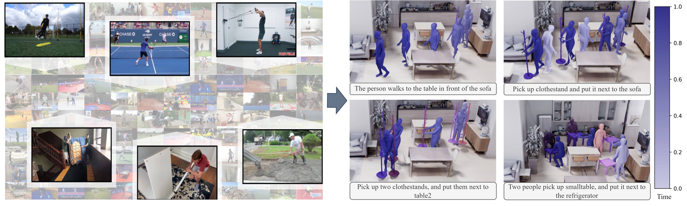

# InterPose: Learning to Generate Human-Object Interactions from Large-Scale Web Videos (arXiv 2025)
This is the official implementation for paper: "InterPose: Learning to Generate Human-Object Interactions from Large-Scale Web Videos".


[[Project Page]](https://mael-zys.github.io/InterPose/) [[InterPose data]](https://mbzuaiac-my.sharepoint.com/:u:/g/personal/yangsong_zhang_mbzuai_ac_ae/EfZbl_t1SNlDsKwIv9PAf64BB5HFSVxRgHqbzoD9saLzQQ?e=EISCx6) [[Paper]](https://mael-zys.github.io/InterPose/)





## TODO

- [x] Release InterPose dataset
- [ ] Data collection framework
- [ ] Spatial control experiments (Training and evaluation)
  - [x] Physics-based model: MaskedMimic
  - [ ] Kinematics-based model: OmniControl
- [x] Zero-shot human-object interaction experiments (Evaluation)
- [x] Application: HOI-Agent (integrate LLM to enable zero-shot HOI generation in 3D scenes)


## Environment Setup
> Note: This code was developed with Python 3.8, CUDA 11.7 and PyTorch 2.0.0.

Clone the repo.
```
git clone git@github.com:Mael-zys/InterPose.git --recursive
cd InterPose/
```

Install environment
```bash
bash scripts/install_InterPose.sh
```

### Prerequisites 
- Please download [SMPL-X](https://smpl-x.is.tue.mpg.de/index.html) and put the model to ```data/smpl_all_models/```.

- Please download all the [processed data](https://mbzuaiac-my.sharepoint.com/:u:/g/personal/yangsong_zhang_mbzuai_ac_ae/EaRaW9p8U2tGsIrvtt858HsBm3FHEflYLz3q32oJGvXsSg?e=6KurAC) and put in ```processed_data```.  

- Install ProtoMotion (MaskedMimic) environment and download pretrained models according to README in [third-party/ProtoMotion_for_InterPose](https://github.com/Mael-zys/ProtoMotion_for_InterPose).

- (Optional) If you would like to generate visualizations, please download [Blender](https://www.blender.org/download/) first. 

### Evaluation: zero-shot generation on OMOMO and BEHAVE dataset.  

```bash
bash scripts/eval_zero_shot_HOI_generation.sh results/masked_mimic_merged/last.ckpt
```

Here is an example visualization script:
```bash
bash scripts/visualization.sh
```

### HOI-Agent: integrate LLM to enable zero-shot generation in 3D scenes

First config [OPENAI_API_KEY](https://github.com/Mael-zys/InterPose/blob/master/run_HOI_agent.py#L19) in ```run_HOI_agent.py```.
Then run the following script:

```bash
bash scripts/run_HOI_agent.sh results/masked_mimic_merged/last.ckpt
```


### Citation
```
@article{zhang2025interpose,
  title={InterPose: Learning to Generate Human-Object Interactions from Large-Scale Web Videos},
  author={Zhang, Yangsong and Butt, Abdul Ahad and Varol, G{\"u}l and Laptev, Ivan},
  journal={arXiv},
  year={2025},
}
```

### Related Repos
We adapted some code from other repos in data processing, learning, evaluation, etc. Please check these useful repos. 
```
https://github.com/lijiaman/chois_release
https://github.com/NVlabs/ProtoMotions/tree/main
https://github.com/lijiaman/omomo_release
``` 